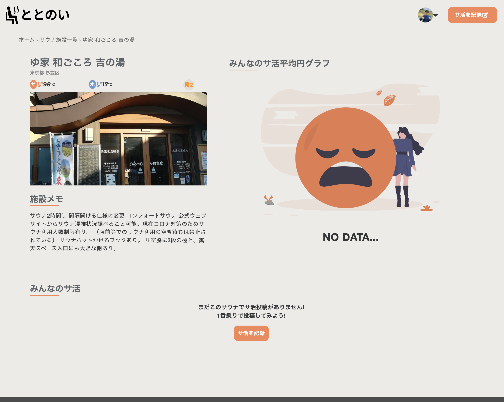

# ととのい

## 概要 
サウナ好きの人達がサ活（サウナ・水風呂・外気浴の時間）を記録して管理するためのアプリです。


アプリURL : https://totonoi.org/

ホーム画面からゲストログインできます。（その他、新規登録画面からも可能です。）


### 読む前に知ってほしいこと
**「ととのう」**・・・ サウナ・水風呂・外気浴を繰り返すことで身体はリラックスし、頭は興奮するトランス状態になること。


参考サイト　: [現役医師が教える、サウナで「ととのう」条件と正しい入浴方法](https://www.pen-online.jp/article/008062.html)

### アプリ制作背景
私はサウナが大好きで最高にととのった日の場所や、サウナ・水風呂・外気浴の時間を記録して、まとめたい思いがありました。


また、自分が初めてのサウナ施設に行くとき、その施設を利用する他のサウナ好きな人達のサ活（サウナ・水風呂・外気浴の時間）を目安にして、ととのいたい思いもありました。

これらの課題を解決するため、このWebアプリを作りました。
### メインのターゲットユーザー
サウナ好き（サウナー）


## 使用画面のイメージ

### ①トップページ

- ファーストビューで何をするアプリなのか分かりやすくしました。
- ログインしてないユーザーにはアプリの３つの特徴が表示されます。
- 新着のサ活（ユーザーの投稿）が3件、サウナ施設（管理者の投稿）が6件表示されます。


### ②新規ユーザー登録ページ

- メールアドレスでの登録以外にお試ししたい方向けにゲストログインリンクを貼りました。


### ③サウナ施設一覧ページ

- PCでは3カラム,タブレットでは2カラム,スマホでは1カラムで一覧表示します。
- 一覧ページからでもブックマークアイコンを1クリックでお気に入りのサウナ施設を保存できます。


### ④サウナ施設詳細ページ

- サウナ施設での全ユーザーのサ活（サウナ・水風呂・外気浴のそれぞれの時間）の平均が円グラフに表示されます。
- サウナ施設でのサ活を一覧表示します。サ活が無い場合、ユーザーのサ活を促すデザインにしました。(下画像参照)


| サ活投稿あり | サ活投稿なし |
----|---- 
|  |  |


### ⑤サ活投稿ページ

- サウナ施設名とサウナ・水風呂・外気浴の時間を入力して、サ活を投稿できます。感想は空でも投稿可能です。
- サウナ施設名は１文字入力すると、文字に関連する候補のサウナ施設名が検索窓のような形で表示されます。


### ⑥マイ保存サウナ施設ページ

- 保存したサウナ施設を表示します。他のユーザーは見れません。


### ⑦マイページ

- ユーザーのサ活（サウナ・水風呂・外気浴のそれぞれの時間）の平均が円グラフに表示されます。
- これまでのサ活、サ活した施設もタブ切り替えで表示できます。
- ユーザーのサ活が無い場合、それを促すデザインにしました。(下画像参照)

| サ活投稿あり | サ活投稿なし |
----|---- 
|  |  |


### ⑧管理者ページ（サウナ施設投稿ページ)
- サウナ施設の【名前】・【ふりがな】・【場所】・【施設画像】・【施設メモ】・【サウナの温度】・【水風呂の温度】を投稿・編集・削除できます。


## 使用技術

### フロントエンド
- HTML
- CSS,Sass
- JQuery 3.6.0

### バックエンド
- Ruby 2.6.8
- Ruby on Rails 6.1.4.1

### インフラ
- Heroku(ステージング環境→本番環境)＋AWS(S3)
- Cloudflare(Herokuに適用した独自ドメインをSSL化するために使用)

### データベース
- PostgreSQL14.0

### その他
- Visual Studio Code（エディター）
- Github(ソースコード管理)
- Rubocop (静的コード解析ツール)
- Draw.io (ER図の作成)
- unDraw(イラスト素材)
- COOL COLORS（全体の配色選定）
- Notion（コードのドキュメント）

## 工夫した点
### N+1問題の解消

- gemの[bullet](https://github.com/flyerhzm/bullet) を使用してN+1問題を発見した場合はリファクタリングをしていました。N+1を発見した場合は下記のように警告画像が出現します。


- 部分テンプレートのrenderメソッドを使う際はeach文の中で使わず、collectionを使用。そうすることで部分テンプレートの呼び出しはレコードの件数が多くなっても１回に抑えることができるので、パフォーマンスが悪化することを防ぎました。（下記のBefore▶afterのコード参照）

**【Before】N+1発生コード**
```Ruby
# インスタンス変数に入ってるonsenの個数分だけ部分テンプレートを表示するロジックなので、
# onsenの個数が多いとパフォーマンスが悪くなります。
<% @onsens.each do |onsen| %>
  <%= render partial: 'onsens/onsen', locals: { onsen: onsen }%>
<% end %>
```

**【After】N+1解消コード**
```Ruby
# collectionを使用して、リファクタリング。
# コントローラから渡された@onsensに入っている各onsenの値を表示するようにしました。
<%= render partial: 'onsens/onsen', collection: @onsens, as: 'onsen'%>
```

### オートコンプリート機能の実装

サ活投稿機能を作成する際、「サウナ施設名」をユーザーに正しく入力してもらうのが大変という課題がありました。

その課題を解決するためにサウナ施設名のワードを１文字でも入力すると、それに応じた温泉名が自動で下に出力されるオートコンプリート機能(検索エンジンなどでよく見かける、文字入力をすると候補が並ぶ機能です)を[easy-autocomplete](http://easyautocomplete.com/)を利用して、導入しました。


### ユーザーのサ活(投稿)に連動した円グラフ
マイページで各ユーザーのサウナ・水風呂・外気浴の平均データを円グラフで表示しています。こうすることで「ととのう」時の時間配分の目安になるようにしています。


### チーム開発を意識

実務を想定して、下記の手順で開発していました。
1. issueにタスクを登録し、
2. それに応じてブランチを切って、
3. プッシュする際はプルリクを発行して、
4. Github上でマージ。
5. そして、issueに登録したタスクが完了後closed。

### UI・UX
-  アイコンやロゴを使用して、パッと見で分かるシンプルなデザインにしました。
-  スマホサイズではユーザビリティを高めるため、ログインしている場合、最下部に固定メニューバーを自作しました。


|  スマホサイズでは下部に固定メニューが表示  |
| ---- |
|    |

- サ活を記録するとマイページの円グラフが変化していき、記録するほど、自分のサ活の傾向が見えてくる設計。
- ユーザーの目に優しく、奇抜な色使いはせず、以下の配色を参考に全体的な落ち着いたデザインにしました。


## 機能一覧

### 基本機能
- サ活関連
  - サ活投稿
  - サ活編集
  - サ活削除
  - フラッシュメッセージ機能（サ活の投稿・編集・削除）
- ユーザー関連
  - マイページのサ活円グラフ表示
  - マイページでサ活した施設の表示
  - 保存したサウナ施設の閲覧
  
- サウナ施設関連
  - サウナ施設一覧を12件ごとにページネーション表示
  - サウナ施設保存
  - サウナ施設詳細ページでみんなのサ活円グラフ表示機能(Chart.js)
  - 管理者機能(Active admin)
    - サウナ施設投稿
    - サウナ施設編集
    - サウナ施設削除

- 各ページにパンくずリスト表示（gratel）

### 認証機能
- 新規ユーザー登録・ログイン・ログアウト
- ゲストログイン
- パスワード再設定
- 新規登録時、パスワード再設定時のメール認証
- プロフィール編集
- 退会


## ER図


## 今後の課題

- サウナ施設のGooglemapと連携
- サ活投稿のTwitterシェア
- AWSにデプロイ
- テストコード
- Vue.jsの使用

## 作者情報

- Kenei Matsuo
- Twitter: https://twitter.com/matsuken_web314
- E-mail: kenei031455@gmail.com
